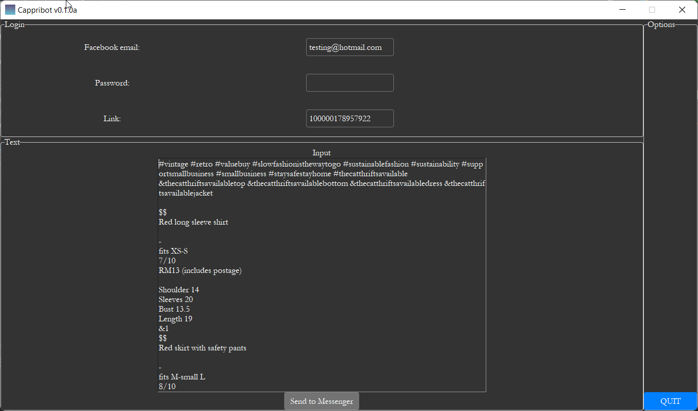

#Cappribot v0.1.0a
Cappribot is a specialized program made to automate the process of sending texts to Facebook Messenger client. Currently, it also supports auto generating Instagram caption entries by automatically changing the font style and apppending specific hashtags.

#Requirements
Due to specific Selenium driver, Microsoft Edge browser version 92 is required. Work is in progress to allow all browsers to access the program. Microsoft Edge is available at
https://www.microsoft.com/en-us/edge

#Usage
to be updated.

#Roadmap
More features, especially general usage ones, are planned at this stage. Examples of features planned include:
* general Messenger scrapping 
* sending text messages to multiple recipients in friends list (optional: repeat the action multiple times)